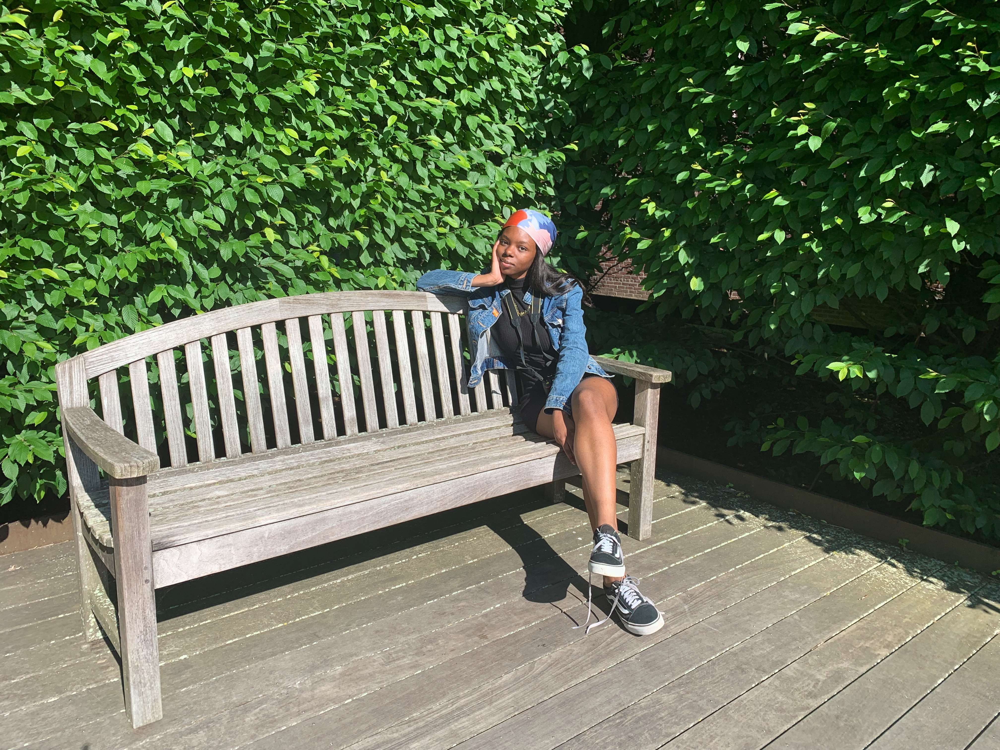

hi im Rachel!! i'm an undergraduate studying computer science at NYU

### the blogger
### the blog

In high school, I joined a computer club. We shared and learned from each other about programming, graphic design, animation, even video editing. I borrowed a book from a friend about PHP and MySQL, and that was the very first time I learned about web programming.

In the second year of high school, our computer club participated in a website building contest. Me, along with the other two friends ([Rizky](https://twitter.com/rprilian) & [Wasil](https://www.halodesigners.com/)) decided to rebuild our school's website from the scratch. We built our own Content Management System using PHP and MySQL. I vividly remember how we presented our website to the juries. I was confidently talked about how our website was built to prevent attacks from SQL injection, cross-site scripting, and even session hijacking. Luckily enough we managed to take first place. I used the prize money to build a new PC with a shiny AMD Athlon 64-bit processor and a brand-new Radeon graphic card.

In college, I took the Telecommunication Engineering degree. During that time my interest was shifted more towards traveling, books, and writing. I spent my free time reading novels or some traveling books. Daydreaming about vagabonding around the world. I would spend every end of semesters backpacking with friends.

I still love programming. I was always excited to attend a programming course. Did a little bit of C, a bit of Visual Basic, some PHP, and a lot of Java. We even learned about assembly language. Used it to program a decades-old Intel 8085 microprocessor. Even my thesis was programming-related. I built a web-based application to visualize and calculate the budget of a radio microwave link.

### call me beep me, if you wanna reach me 😗
* twitter - [@therachelplan](https://twitter.com/therachelplan)
* ig - [@rachelombok](https://www.instagram.com/rachelombok)
* github - [rachelombok](https://github.com/rachelombok)
* email - [rachel.ombok@nyu.edu](rachel.ombok@nyu.edu)

### elsewhere...
* dev.to, etc

### subdomains
* [main](https://rachelombok.com/)
* digital garden

Years later, my passion for computer programming is stronger than ever. Now I'm writing code for a living. I help my clients to launch their dream website. Sometimes I help startups to ship their million-dollar idea ([one of them got acquired](https://www.crunchbase.com/organization/fixd-repair) for tens of millions of dollars in 2019). I work with companies to manage and analyze their data, so they can make better decisions and grow their business.

This website serves as an archive for my thoughts. Sometimes I write about [programming stuff](/code/). But most of the time I blog about my [daily life](/categories/journal/), my [traveling](/categories/travel/) experiences, or any [random stuff](/categories/writing/) that comes to my mind. I occasionally posted some [photos](/categories/photos/) too.

This website is generated using [Hugo](https://gohugo.io/) and hosted for free on [Vercel](https://vercel.com/). You can check out the entire source code on [Github](https://github.com/risan/risanb.com).
