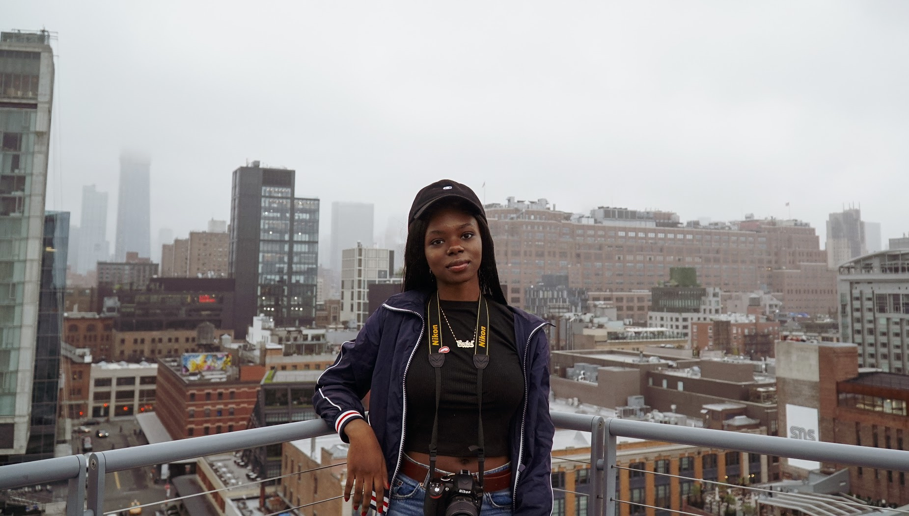

### the blogger

hi i'm Rachel! im a computer science student interested in **web development**, **games** and **ar/vr**.

right now i am currently studying at NYU, and this summer i will be interning @twitter. i made this blog to document some
non-programming topics in my head. im not sure what else to say here so maybe ill update it more in the future :P

<!---
### the blog
 --->

### call me beep me, if you wanna reach me 😗
* twitter - [@therachelplan](https://twitter.com/therachelplan)
* ig - [@rachelombok](https://www.instagram.com/rachelombok)
* github - [rachelombok](https://github.com/rachelombok)
* email - [rachel.ombok@nyu.edu](rachel.ombok@nyu.edu)

### elsewhere...
* devblogs - [dev.to](https://dev.to/rachelombok)
* pix - [vsco](https://vsco.co/rachelombok/gallery)

### subdomains
* [main](https://rachelombok.com/)
* digital garden  

this website is generated using [Hugo](https://gohugo.io/) and hosted for free on [Github Pages](https://pages.github.com). this is modeled after the template created by [risanb.com](https://risanb.com), and you can check out his entire source code on [Github](https://github.com/risan/risanb.com).
