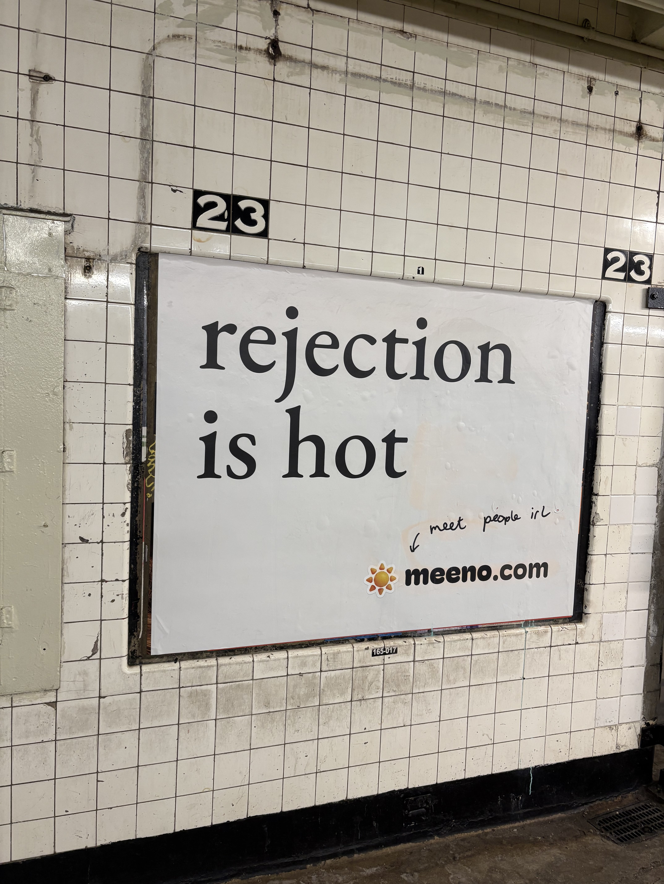
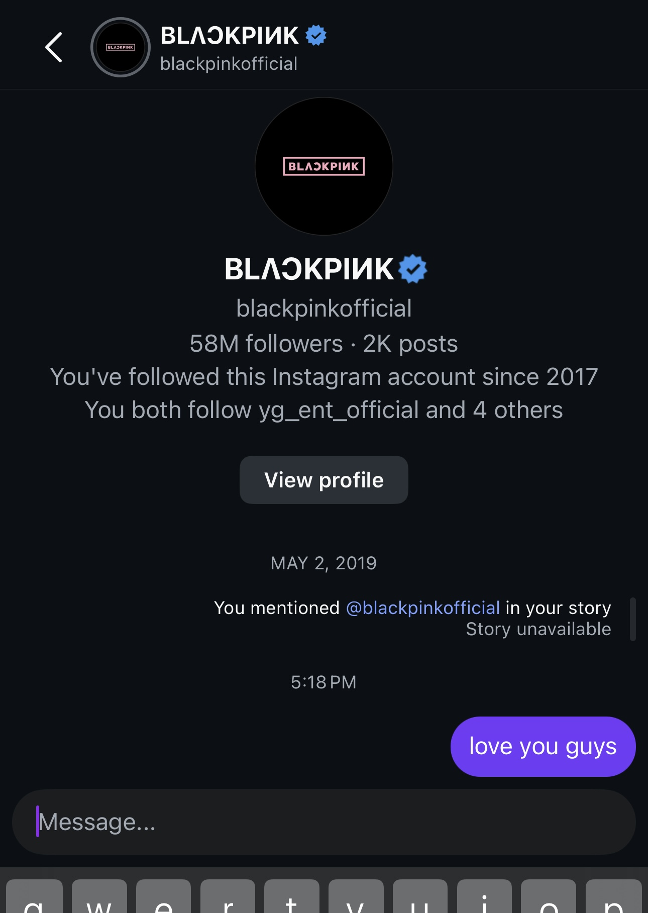

maybe it is more apt to say *‘rejection is haute’*, because right now rejection is in! 2026 is the year of rejection. i think the new year energy of creating resolutions and getting into the mindset of putting yourself out there is a great way to start the year. some people dislike them, but personally ***i love*** new years resolutions. i love a fresh start, a new beginning and a concrete mark for it happening. i love making complicated documents outlining everything i want to accomplish, itemizing and scheduling my goals as well as seeing incremental progress. maybe i am not jaded enough with the process to hate it as much as others do but i love a new year's reset.

### THE SETUP

early in January i came across a post from [Grace Ling](https://www.linkedin.com/posts/graceling_replitpartner-newyears-activity-7412927040527491072-DTyq?utm_source=share&utm_medium=member_desktop&rcm=ACoAACIUqfABY1uqDsxihtGzP7fRhBHY5V2L8DI) who i've followed through [Design Buddies](https://www.designbuddies.community/) for years, about a challenge activity in the new year, the [Rejection Therapy: The 30 Day Cold Outreach challenge](https://rejectionchallenge.com/). the idea of the challenge is to get comfortable with advocating for yourself, shooting your shot and taking action **NOW** and **TODAY** for what you want. so it only made sense for me to delay my participation in the challenge by a month to mentally prepare myself for the rejection to ensue. i rationalized it because i found out about the challenge late, but also i kind of had to brace myself for the messages i would send. 

i don’t think my relationship with rejection is unique compared to anyone else, it’s obviously something i would rather avoid so i try to prepare as much as possible before trying something, but sometimes i do take that rare risk of jumping off the deep end into something i have no clue what the outcome could be. and sometimes it surprisingly works out well, sometimes i do get a rejection and its mildly disappointing, but mostly it is just fine. i can only think of 2 scenarios in my life where i was rejected and it was a devastating canon moment for me, but ultimately i am still here, so 👍.

when reading the prompts, some of them honestly did intimidate me, like reaching out to someone i havent spoken to in a long time, or asking for *"a favor"* from someone. i wanted to log my progress on how this goes, and i already knew each day wouldnt be a success or result in a call or if i will even have the guts to send the message 😅 but it's just about taking the step to be okay with rejection, or even just no response. the prompts were each broken up into categories of 'Admiration', 'Reconnect', 'Sponsors', and 'Career'.

### THE CHALLENGE

## *Day 1 - Message an old colleague you admired but lost touch with. Just say hi and ask how they are.* {#day1}

emailed a colleague from my old job. he replied! it's crazy how this was the first one and instantly terrified me when i read it. i am not the best at keeping touch with people after leaving, or so i think. but this was a really pleasant reconnect with someone i worked with for years.

## *Day 2 - Email an author of a book that changed your thinking. Thank them specifically.* {#day2}

i didn't have one, i embarrassingly don't have a book i read recently or can even remember one that changed my thinking so to speak, so i instead messaged someone i knew on Linkedin who wrote a [blog post](https://umxe.substack.com/p/you-should-tell-people-what-your?r=6d7pl1&utm_medium=ios&triedRedirect=true) i liked, similarly in theme about putting yourself out there and the payoff of being seen vs ‘moving in silence’. there is power in saying what you want and going after it, out loud.

## *Day 3 - Find a company you love. Message a peer there asking 1 specific question about their culture.* {#day3}

cold messaged someone at one of my proverbial “dream companies” in a similar position of mine on how they like working there and their journey of joining the company. i didn’t know if this prompt specifically was asking for someone that you knew with the term “peer” but i went for it anyway. they did not respond to me.

## *Day 4 - Identify a tool you use daily. Ask their marketing lead if they work with creators/consultants.* {#day4}

honestly it was tricky to nail down a ‘tool’ i use daily. not a social media app like Instagram or Reddit, not a product like ChatGPT or Apple Music, and not like a physical good like my headphones. but a tool. something designed to perform a specific task and improve or facilitate a process i do daily. i didn’t get the idea until days later that something i use everyday is the [Google Home app](https://apps.apple.com/us/app/google-home/id680819774). every morning before i go to bed i am always adjusting the temperature. whether it's too cold in the morning when i wake up in January or too hot at night in June, i always adjust the temp through the app and it controls the heating and cooling in my room. and i never have to leave the comfort of my covers. it's amazing because i don’t have to get out of bed freezing to turn the heat up, and while it warms up the apartment i can stay in bed until it gets to a suitable temperature for myself. best life hack ever.

i searched on Linkedin for Google Home marketing and found someone with the role title of 'Partner Marketing at Google Home' and asked if they do collabs with creators. honestly have no clue what i would even offer for a collaboration on this but nonetheless, i asked. this received no response. (this is where having Linkedin premium would definitely come in handy)

## *Day 5 - Send a compliment to a creator whose content you consumed yesterday.* {#day5}

i knew this one had to be spur of the moment of who i looked at the day before. there is an instagram account for kpop marketing [@yoyotwinkles](https://www.instagram.com/yoyotwinkles/) who makes content around the marketing of kpop. the content is informative and just looks so good, her branding is very strong and unique. it combines two topics i havent seen put together in a content creation way but just makes sense. so much of kpop is marketing and branding. DMed her about how i liked her content, no response. 

## *Day 6 - Text a friend you haven't seen in 6 months. Propose a specific coffee date.* {#day6}

texted my friend i hadnt seen in like 2 years, only to find out she was moving back to NYC recently! we met in college and she moved to the west coast but then was coming back for work. i ended up going to her housewarming and we reconnected!

## *Day 7 - Ask someone 2 steps ahead of you for a 15-min virtual coffee to ask about their journey.* {#day7}

messaged someone i met in the [Google Women Techmakers program](https://developers.google.com/profile/badges/community/wtm/member) before i found my current role. we collaborated on a womens history month event and she was a senior engineer at a large tech company. i asked her for a short time about her role and how she got to senior level and what shes thinking of now in her career.

her perspective on growing as an engineer was amazing, i was kind of taken aback at how much confidence she had in herself and what she wanted next, and only wished i could gain that too. we spoke about the importance of ‘being seen’ and making sure your good hard work doesn't go unnoticed, because there is little benefit for that. also the vibe of large company vs startup, corporate culture and what getting to the next level requires. this is definitely one of the best payoffs i received for this challenge so i am very happy i reached out!

## *Day 8 - Reach out to a local business owner you respect. Tell them why you love their shop.* {#day8}

messaged the founder of this homemade natural haircare brand i found over COVID, [Ariana Almira](https://arianaalmira.com/). very good products and strong branding as well. while i am so skeptical of buying homemade beauty products, her brand is so strong. messaged her directly through Instagram, no response.

## *Day 9 - Pitch a small paid project to a local business (e.g., improve their website copy).* {#day9}

this is the first day i couldn't come up with a person to reach out to. no clue what i would even do. honestly creating a website for a business is not an easy task and not something i am interested in doing at this current moment in time. besides this, i didnt know what kind of project i could offer a business. i thought about maybe a photography project or shoot, but again i don't know how i would pitch this. i don't even have a studio. i did see this [Instagram Reel](https://www.instagram.com/reels/DSnYHrOEQio/) of a guy pitching photos to a cafe for free (but he ended up getting a bunch of drinks in exchange) but i am not a product photographer. if anyone has a small business that needs technical or creative help, <a href="mailto:rachel.ombok@gmail.com">email me!</a>

## *Day 10 - Message a former professor or teacher who made an impact on you.* {#day10}

messaged my freshman calculus teacher, who was an amazing professor and ended up teaching my favorite class freshman year. he ended up responding! such a pleasant interaction as well. 

## *Day 11 - Ask a recruiter for feedback on your LinkedIn headline (be polite!).* {#day11}

i have a lot of recruiters in my Linkedin. i'm honestly flattered but they all just end up being ignored or kept in my InMail. but i decided to utilize one who messaged me and politely declined the job but then immediately asked for feedback on my headline (which is just ‘Software Engineer’). they did not respond. personally there is probably a more eloquent way i could have gone about this.

## *Day 12 - Send a 'fan mail' DM to a podcaster you listen to regularly.* {#day12}

sent a DM to my favorite podcaster i've been listening to for almost 5 years and have seen live 3 times. i listen to this show constantly, it is super funny and has perfect background noise and easy listening perfect for working. there’s not really any way for me to pitch this show effectively to encompass what it is. but it's truly a serial that anyone can jump in and listen from pretty much any point. this was one of my favorite episodes of 2023;

<iframe width="100%" height="415" src="https://www.youtube.com/embed/elG4_HYGLnQ?si=s1-ahDkVwoD8Jn0F" title="YouTube video player" frameborder="0" allow="accelerometer; autoplay; clipboard-write; encrypted-media; gyroscope; picture-in-picture; web-share" referrerpolicy="strict-origin-when-cross-origin" allowfullscreen></iframe>

## *Day 13 - Ask a software company if they have an affiliate program you can join.* {#day13}

i asked the team behind an app i really like about the concept of ‘Headway’, a hair tracking app, if they had a program. they don’t seem to be active on social media at all but i still asked. no response here.

## *Day 14 - Reach out to someone you met at a conference/event once but never followed up with.* {#day14}

messaged someone i met at a small networking event in 2024 who was still in school how they are doing now. they did respond but i will say this one felt awkward because i am not asking for anything or even had a question for her. it was kind of this conversation that kind of dangled and didnt have a succinct end. not gonna lie these kind of random checkins messages feel strange when there is no purpose behind it.

## *Day 15 - Message a founder of a small startup. Ask what their biggest challenge is right now.* {#day15}

messaged [Jia](https://www.linkedin.com/in/audrey-chen-tech/) from [Jam](https://www.spreadjam.com/landing), who i found from Linkedin from her hackathon reputation. she said her biggest challenge was moving fast while still being thoughtful, and how having a bias to action is good but is also sprinting very fast and at the same time knowing what's going on. sounds accurate to startup life.

## *Day 16 - Tell a designer/developer you love their portfolio.* {#day16}

messaged someone who i had followed on Linkedin for his creative tech work and founded his own independent agency. i saw he took a break from work and ended that project and moved to something new. he had a great portfolio that looked like a Mac desktop. i love portfolios that mimic real life products. had a great conversation with him on Linkedin on what hes doing now and why he pivoted. 

## *Day 17 - Check in on a former client or boss. No ask, just well wishes.* {#day17}

emailed the lead of my research internship in college, and probably my favorite one from undergrad. no response here. 

## *Day 18 - Pitch a guest post to a blog in your industry.* {#day18}

the ‘in my industry’ part was my struggle. i didn’t know what tech blogs i could even reach out to for a contribution or what i’d write. i ended up instead reaching out to a Kpop publication, asking if i could review BLACKPINK’s Deadline mini-album as i see there wasn’t one on their site yet. i am trying to gain more experience and relationships with various publications as i like to cover [live music events](https://portfolio.rachelombok.com/concerts) and usually need to be tied to a publication to do so. they responded that they do not take in contributing writers articles, but will keep me in mind still for future event photo coverage. so this was technically a rejection but didn’t feel so.

## *Day 19 - Ask a senior leader in your industry for a book recommendation.* {#day19}

reached out to the head of Data Science at my company, who actually was my first interviewer for my job, asking for some resources for learning more about agentic AI and how we come up with AI solutions at our job. she sent me a bunch of links and things to read! to be honest, working at a startup it's amazing the kind of direct access you have to the leaders and figureheads at the company. 

## *Day 20 - Thank a YouTuber for a specific tutorial that helped you.* {#day20}

instantly knew i had to send a message to Micah D, the girl who made [this tutorial](https://www.youtube.com/watch?v=Oz4Cv8HCIJo) which was the biggest component in me learning how to braid my own hair. i can braid better than i can flat twist now. i do have to rewatch this video still before i cornrow but i have the pattern down pat, and my hands dont get cramped up anymore when braiding. 

<iframe width="100%" height="415" src="https://www.youtube.com/embed/Oz4Cv8HCIJo?si=om7-LfAyLnZq5cct" title="YouTube video player" frameborder="0" allow="accelerometer; autoplay; clipboard-write; encrypted-media; gyroscope; picture-in-picture; web-share" referrerpolicy="strict-origin-when-cross-origin" allowfullscreen></iframe>

## *Day 21 - Message a cousin or relative you rarely speak to.* {#day21}

messaged one of my cousins that i almost moved in with! we both went to school in NYC and after college were looking for apartments at the same time. did not respond. 

## *Day 22 - Ask a brand for a sticker pack or swag in exchange for a social post.* {#day22}

kind of hard to ask for swag in exchange for a social post when i am not a content creator or influencer [(even though i do have a photography instagram 👀)](https://www.instagram.com/rachels.rchive), but i decided to ask [B&H](https://www.bhphotovideo.com/) for stickers or swag. they are my favorite photo store and i have bought all my equipment from them since i graduated.

## *Day 23 - Ask a peer for a LinkedIn recommendation (and offer one in return).* {#day23}

i had a coworker i wanted to ask for this but was way too preoccupied and couldn't find a good time to ask them 😭. i definitely want to come back to this one though, i've never asked someone for a Linkedin recommendation. i honestly wonder how useful they are on a Linkedin profile.

## *Day 24 - Send a message to a TED talk speaker whose talk you enjoyed.* {#day24}

dont really watch TED talks, i don't think i've watched a TED talk since english class in high school when one of my teachers loved showing us them. i much rather listen to podcast interviews than a TED talk. if you have a good TED talk i should listen to, send it my way!

## *Day 25 - Message an old mentor. Update them on your progress.* {#day25}

i had a mentor during sophomore year of college i met through a women/girls in tech program. she was a career mentor but also a ‘woman’ mentor as a whole. she talked to me about a lot of different facets of life and brought me to cool exclusive coworking spaces in NYC. she was a true career woman and super highly accomplished. we hadn’t spoken since my senior year of college. reconnected through email, no response as of yet. 

## *Day 26 - Pitch yourself as a podcast guest to a small show.* {#day26}

i love this one. i pitched myself to this amazing Riverdale podcast, (The River's Edge)[https://podcasts.apple.com/us/podcast/the-rivers-edge/id1838317193], who takes applications for rolling guests to the show. if you know me you know i love Riverdale, unironically. i have read Archie comics since i was in elementary school, have an extensive collection of issues i always hunt for at flea markets, and when the first season aired my junior year of high school i never missed an episode. i was a fan until the end, and still now. i applied to be a guest for an episode and haven't received a response yet.

## *Day 27 - Ask someone for an informational interview about their specific role.* {#day27}

*SO*, i am actually working on my own game. in college i minored in game engineering and always wanted to make games since high school. i made plenty of prototype games before and even full fledged ones but never solo on my own. i am beginning to develop my own games, completely made by me, and [developing systems](https://www.youtube.com/watch?v=QPuIysZxXwM&pp=ygUXYnVpbGQgc3lzdGVtcyBub3QgZ2FtZXM%3D) that will eventually help me create my dream game.

the game i am currently developing is ‘Podcast Simulator’ (WIP name), a game that takes you through the journey of starting and growing a podcast. i honestly have developed a serious interest in the business of podcasting. the inner workings of podcast networks, the contracting and business, the creative and marketing aspect and even the rare ethical dilemmas associated. i have always listened to podcasts since like high school but i really got into it when i took a [Podcasting Workshop](https://unmutepodcast.org/) in undergrad and created and produced an episode of [my own show](https://rachelombok.com/huztle). 

i messaged my professor from there, who is a producer at a podcast publisher/distributor/producer agency that helps independent organizations create and foster audio storytelling to their audiences. i was able to meet with her and some of her producer colleagues about the industry and process of independent podcasting, and the meeting left me with such interesting ideas of what my game should be like. this was probably the biggest payoff from this challenge because i genuinely did not expect a response but instead i got to talk to people who make podcasts for a living and had free reign to ask them questions for almost an hour. i came out of it ready to change the entire thesis of the show and who would be telling the story, and even core gameplay. stay tuned for devlogs of Podcast Simulator™.

## *Day 28 - Write a genuine review for a product you love and email it to the founder.* {#day28}

okay so i was stuck on this one too when reading the challenge for the first time, but after filing my taxes, i got it. a product i love and have used for two years now is [FreeTaxUSA](https://www.freetaxusa.com/). after graduating from college i had to do my taxes myself for the first time, and i just used the broker service at H&Rblock, which was terrible. it was much more money than advertised and i had to follow up with my guy to even get a status update on my return. just not very high quality. but then i found out about FreeTaxUSA through Reddit, and have never looked back. it makes filing my taxes so easy, walks you through each step and component of your return, and also has a great UI design. i promise this isn't #ad. my taxes are fairly simple but i think someone with a more complicated return could do it just as easily. AND i paid under $30. i did not get a response when i emailed them, but i couldn't email the founder directly as he didn't have a public facing contact, so i emailed their sales team to pass on the message. 

## *Day 29 - Message someone you had a disagreement with (if appropriate) to break the ice.* {#day29}

LOL. i did not have anyone i wanted to message with for this one. 

## *Day 30 - Shoot your shot. Message your 'Moonshot' person. The one you think will never reply.* {#day30}

### The End

so to tally it all up...

Sent - 25

Replies - 10

No response - 15

Rejections - 1

all in all i think this was a successful challenge, even though there wasn't much 'rejection' but rather some ghosting and even some good and surprising outcomes. and… i am still here. the lesson is that even with rejection or just plain ignoring, it doesn’t have to end your life or send you spiraling, you can pivot. and that's the important lesson, i think.

to be more intentional with reaching  out and following up in the future i created a Google sheet that tracks connections and who i reached out to, and noting their name, email/number, when we met, the last time we connected, where we met, what industry they are in and what level, and any notes about our relationship or next checkin. i learned this from someone at a conference to always track the professional connections you make. they say to message them every quarter, i am not sure about that yet but its good to check in on the sheet once and a while to know who to reach out to.

try the [Cold Outreach Challenge](https://rejectionchallenge.com/) yourself! doesn't have to be a new years resolution or top of the year thing, rejection is always in fashion. 