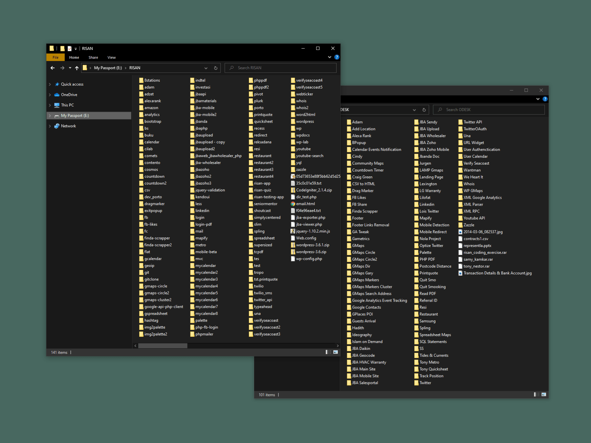

Digging through my old hard drive and found these two folders containing more than 200 projects from my early days as a web developer in 2013. I'm amazed by so many things I've built during that time—though I believe most of them are just a simple one-page website. But still. 

Back then, I had no idea how to write clean code or heard about [SOLID principles](https://en.wikipedia.org/wiki/SOLID). I didn't know about Git or any other version control. I had never use any fancy web or CSS framework before. I had no clue about unit testing or integration testing. Yet, I still managed to build that many projects.

But now, after so many years. I turned into this over-thinking programmer. Who are too scared to lunch his project into the wild. I slowly grew the thought that if I want to publish my project, it needs to be perfect. I was setting a too high standard for my work. Or maybe I was just afraid that other people would judge my imperfect work.

Is it going to scale? How should I structure the code? Should I use JavaScript or PHP? Is this framework fast and optimized enough? Do I need to go with AWS or stick with $5 VPS on DigitalOcean? What if no one uses the website? All these questions popped out even before I wrote a single line of code.

***

I found the following parable on an online forum, it's originating from the book of [Art & Fear](https://www.goodreads.com/book/show/187633.Art_and_Fear):

*The ceramics teacher announced on opening day that he was dividing the class into two groups. All those on the left side of the studio, he said, would be graded solely on the quantity of work they produced, all those on the right solely on its quality.*

*His procedure was simple: on the final day of class, he would bring in his bathroom scales and weigh the work of the "quantity" group: fifty pounds of pots rated an "A", forty pounds a "B", and so on. Those being graded on "quality", however, needed to produce only one pot – albeit a perfect one – to get an "A".*

*Well, came grading time and a curious fact emerged: the works of highest quality were all produced by the group being graded for quantity. It seems that while the "quantity" group was busily churning out piles of work – and learning from their mistakes – the "quality" group had sat theorizing about perfection, and in the end had little more to show for their efforts than grandiose theories and a pile of dead clay.*

***

This story hit me hard. I became this programmer that just sat and theorizing about perfection. It then threw me back to my early days, where I would spend hours building stuff and putting it online. I didn't care about the clean code. I didn't care if no one visits the website. I did it because it was fun. And I took pride in what I built—though now reading the source code makes me frowned.

I want to bring back this spirit. Don't over-think, just build the stuff and ship it. Building stuff should be fun, right? I will consider this to be my new year's resolution for 2021. My initial target is to build something during the weekend, maybe once every two weeks. It might not seem a lot. But one thing I learned from my cycling journey throughout this year is that we need to start with something small but consistent. This way we're avoiding burnout and more likely to achieve our resolution. So let's build stuff again!

