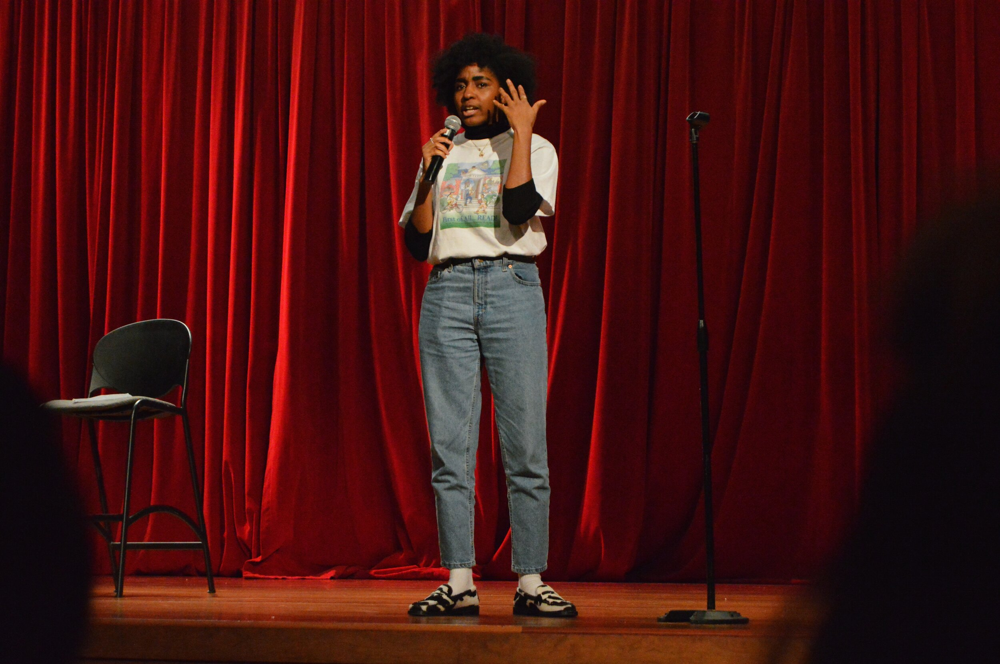
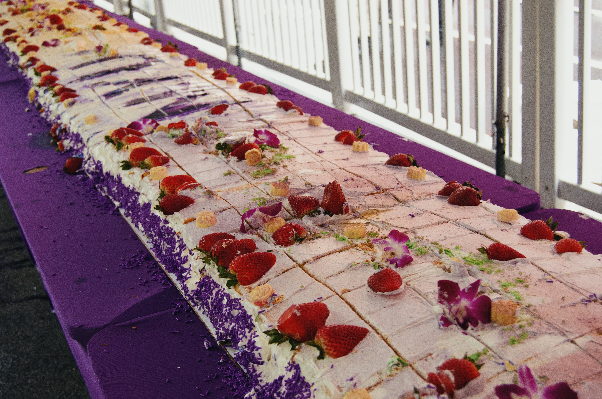

when i was a senior in high school, my grandma gave me a nikon d3200 as a graduation present. i had been into photography and taking pictures before but didn’t have any real equipment to practice with. by the start of my freshman year of college I had a million ideas and places i wanted to shoot. granted i was not great at the start, but that is why you practice right? to ultimately get to a place where you don’t cringe at your terrible faux-artsy shots. i always liked photographing people and interesting places, usually i would just take pictures of my friends and around NYC, but in 2022 I began learning more about concert photography from an upperclassman in a student club i was in. he taught us about how to best adjust your settings to shoot in lowlight, high motion environments like concerts, how to find a publication and be represented for press pass, or even creating your own publication, and how to edit the photos and find your signature style. it basically was a crash course into live photography and i knew this would be my new preferred photography interest. of course this was dampered a bit through COVID, when I was living at home and there wasn’t really any concerts going on, but in 2021 when I came back to NYU for senior year, i became the Events & Media sub-chair for the Program Board student club, which organizes the university wide student body events at NYU. 

(3 images i took as pb chair, ayo, concert, strawberry fest)
  

At the start I had a photography site on Adobe (link thomas portfolio), through school I had an Adobe creative cloud license and could use any of their services, and had uploaded all my work to there. Then when i graduated Adobe said ✌︎︎  and my site was immediately inaccessible and taken down that summer. So i had nowhere i could show my work and direct people too. I did still have my photography instagram profile(link that), which honestly is what most people ask for when they ask for my photography. I could probably get by with just having that, but ive experienced that instagram does compress and downgrade the quality of some of my photos, and i have been spending less and less time on instagram lately and updating it seems more and more of a chore. 

At this point, as a computer science student and software engineer, i only had my personal portfolio which i had just made with html, css and jquery. It wasn’t anything super sophisticated or impressive, and there was no way at that time i would have been able to make something comparable to the Adobe Thomas theme. So i just sat on my hands, i was too busy with work anyways. Then when i lost my job (link this), i had all this free time on my hands and one of the first things i did was renovate my personal site. And it actually came out pretty good. Then after a while of getting my current job, and learning even more about web development, SDKs, tailwind styling, i decided i was ready to attempt building my own photography portfolio. My favorite projects, and really the only ones i ever do are ones that i can actually share and utilize in my personal life and have use for. I never enjoyed doing projects just for the sake of doing them, or to pad my resume, like having a to do list app i would spend a weekend building and never use again.
9pic logos nestjs, imagekit, vercel

I wanted to take this opportunity to use my skills i built at work but try new technologies, so i decided to checkout NextJS for building the site, Vercel (by NextJS) for deploying and analytics, and ImageKit as the SDK which served the images. I knew i was ready because i had never used an SDK (Software Developer Kit) or CDN (Content Delivery Network) ever before until my current job, only read about them in my system design studies. So I was comfortable with the idea of using them here and knowing what to do. If i had tried a couple years earlier i would have been clueless.

ENG PROCESS

One of the top skills/technologies i saw on job postings when i was unemployed was Nextjs for frontend and fullstack developers, so i was curious since i’d never used it before. I read some stuff about it, and the biggest draw was the SSR (Server-Side Rendering) and the optimized image component. These two combined would make my site fast and quick to load while also optimizing its search engine rankings. So i spun up a new repo (link) and got to work.

I made a low level design doc to divide up the work and outline what i wanted the site to be, the file structure, and what other features it should have. I modeled it after my old portfolio on Adobe, while also extending some pages for things I feel like I couldn’t have with my old portfolio. My top checklist items were having a grid layout on each page for displaying different photo collections, categories for each photo collection type (concerts, portraits, events, street,), a film photography standalone page, an About and Contact page, and of course a completely responsive site accessible on mobile. 

Tailwind was a godsend with the styling, making organizing the grid layout on desktop and mobile so easy. And also laid the groundwork for making the styling consistent across the whole website. I can’t imagine developing without it. 

To develop I just used dummy images to make sure the display would work for different sized images, and then i worked on the ‘non photo’ pages like About and Contact which were very simple. Then once it all looked good, i started to set up my ImageKit. 

ImageKit free tier allows for a lot of customization and storage, including a 20gb bandwidth per month, 3gb DAM storage, and 500 video units. To organize i created folders for each of the categories i made, and then within those more folders of the photo collections in that category. 
( image of imagekit folders) 

Each cover photo i wanted the collection to have i named as `{folderName}_01` so that when i could easily access it in the code. Then i configured the photos to be accessed in ascending order by name(fact check). To access the APIs and data there were some environment secret keys i had to configure which were very easy to do in Vercel, and also making sure i optimize each image according to its dimensions and resolution. While the images request was pending I display a blur on each image so that it can indicate to the user that the data is still fetching.

The best way I was able to debug and see what parts were missing from my portfolio is just to have someone interact with the site unprompted and give them very little information on what to do. I had someone go through my site and saw where they got lost, confused, frustrated, which parts they liked and which parts they wanted more of. I am not a designer or a ux genius by any means so this “user research” greatly helped in polishing the site. Of course i wanted to add some flair in there to show it was really designed by me so i added a lot of pink accents in places.

Learnings & Tweaks for the Future

This was a great project to stretch my web dev/fullstack muscles and there were a great deal of learnings post-development.
Learnings
I discovered very quickly how frustrating the file based routing structure of NextJS can be. I cant imagine building anything substantial with it
I disliked how environment and server variables worked together, and the useSWR hook used for fetching data was a pain because it could only be used in client components
This was my first project experimenting with SSR, and i definitely could have structured the component architecture to avoid having so many components be client based as opposed to server side rendered, since that is the entire point and advantage of Nextjs
There is definitely a way to make the entire site usable and self service from just ImageKit, if i wanted to adjust how a cover appears on the site, or decide to pass the name/description of the collection to the app I should be able to, but as of right now it is hardcoded into the app. In an ideal world i could add a new folder on my site and it would add a new tab in the navigation and route as well
There is metadata options you can configure on images and folders to pass information about an asset on ImageKit, i should utilize that more instead of hardcoding the information in the frontend
Vercel is a great deployment tool, I may like it better than Netlify. It was very easy to add Analytics and environment variables for deployment
Standardizing files is very important, i experienced a bug that was causing the image on my about page to fail because in the code it used .JPG but in the build logs it was being referred to as .jpg which took me almost an hour to find and fix
Future Improvements
I want to add a clickable slideshow component for all the galleries
Adding a “You may also like” preview tab underneath each page like how Adobe does
Making it more responsive, i developed it for regular desktop screens and mobile, but i showed it to someone on a very large library computer and made me see its not the best optimized for large screens
Maybe ill add a homepage or landing page for people to get an overview feel of the site, but for now it just redirects to /concerts

All in all i am very proud of the site and how it turned out! There’s still a long list of improvements and tweaks i plan to make in the future and more photos to take, obviously. If you are in need of a photographer or just want to chat photos email me.
