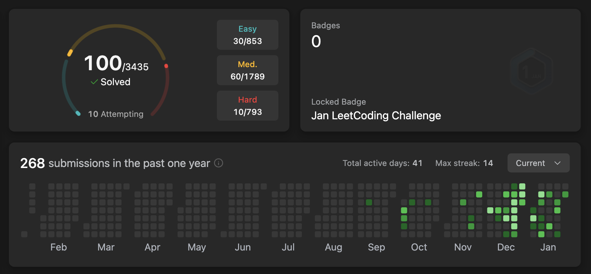
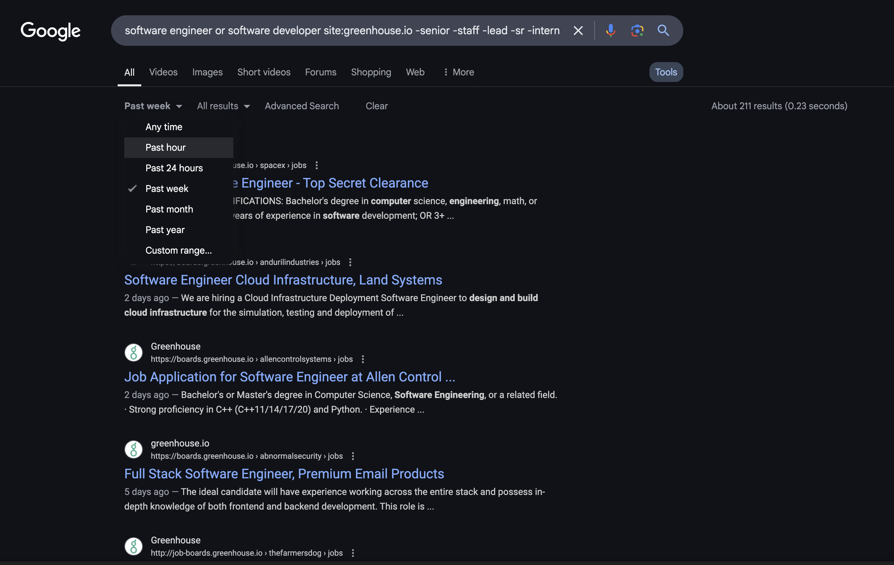
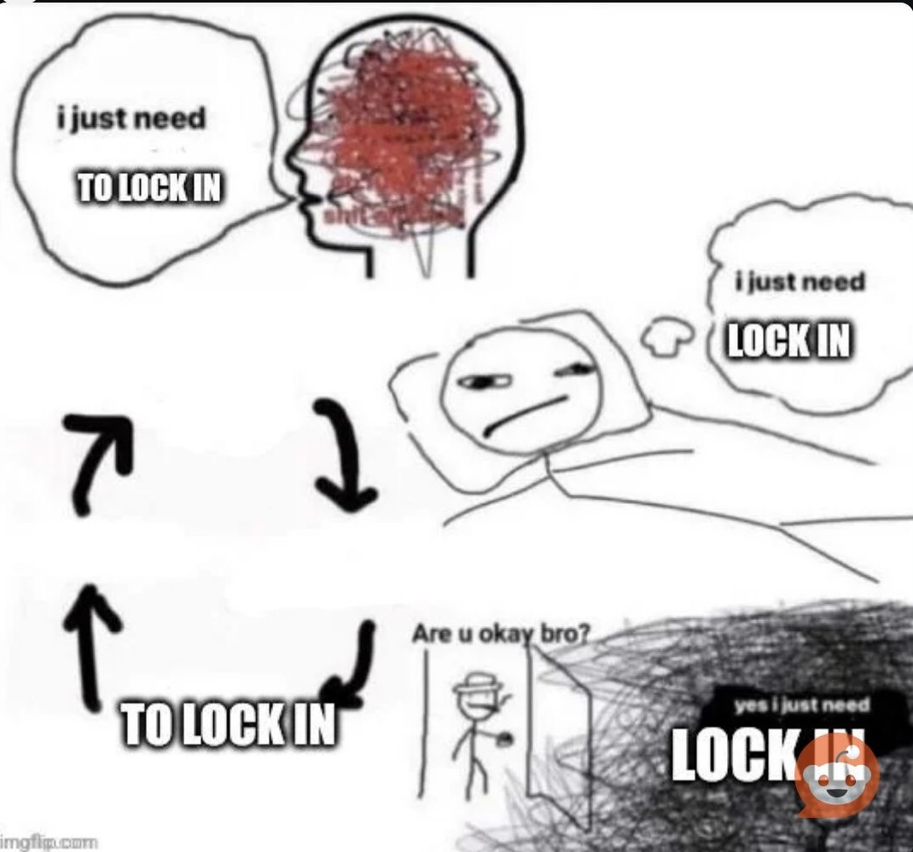

today i start my [new job](https://distyl.ai/). after a long 10-month job process and 400+ applications, i’ve finally accomplished what seemed like the (almost) impossible— going through this arduous process for candidates, practicing the technical questions, sending out regular applications, attending all the necessary networking events, and constantly tweaking my resume. writing out all those tasks on paper doesn’t really make it out to seem all that different from any other job search for any other person in the last 25 years of this millennium, but i know many are feeling and felt the way i do. 

### today's gripes

it’s estimated that **20% of job-seekers have been hunting for their next role** for at least [10 to 12 months](https://fortune.com/2025/01/30/job-hunt-candidates-applying-a-year-ghosting/), and many candidates, especially new grads, are submitting hundreds of applications in their job search. looking for a full-time job is a full-time job in itself. on top of doing the work to actually get in front of companies and acquire interviews, you also need to be upskilling and working on your career skills outside of having a gig. making sure you are not deemed obsolete or let your skills deteriorate in your prolonged unemployment period. 

so what gives? what is the reason or purpose of this dreadful, barren job market(for white collar/tech market) anyways? most people i speak to have all acknowledged the shift in the job search today, and have agreed the bar has been raised exponentially. there is more demanded of the candidate, in the application process, in screenings, in interviews etc. there's nothing quite like it. the amount of hoops you have to jump through for a chance to work in your designated field and support yourself feels draining at times.

i’m attempting to make sense of this all here in this post to maybe have it make sense to others who were in the same position I was. 

### my unemployment journey

i was laid off from my job at the beginning of last summer, and i sort of knew it was coming with a short notice, and had the chance to brace for impact a bit. i fortunately received severance support, and started my unemployment with a comfortable cushion. i took the summer to recalibrate and enjoy summer in NYC with no ties or obligations to anything. it was probably the best summer i ever had in my life. the only work i did during this time was re-doing my [portfolio website](https://github.com/rachelombok/rachelombok.github.io) in React and Tailwind. it had previously been in just basic HTML + CSS that i created in my sophomore year of college. 

around September time i dived in deeper on my search and actually started actively looking. i updated my resume, applied to some jobs on Linkedin and created a new job tracking sheet on Google sheets, as i had for my last 2 job search processes in college. the first two months of the search were a bit shaky for me, getting back in the groove of applying and studying for interviews was hard. the last time i had done it before, “heavily” we’ll say, was during my junior year internship search process. 

i bought a [Leetcode premium](https://leetcode.com/subscribe/) membership and used Linkedin and my school job board, but only received 2 interviews in this time, which i had thought was terribly low. i thought *“but i have 2 years of experience?? i thought job search was only rough for new grads with no experience??”* but i was wrong. there was a continuous shift through the next 7 months of looking, specifically two that came in October, and then another in February. 

in October i cold applied to a really good tech company, and actually got the chance to interview. i probably had done 10? 15? Leetcode questions at all by this point, and had completed 60 job applications total. i made it through the phone screen and then had the onsite spread out over 2 days. i didn’t feel the most confident through the onsite interviews but didn’t bomb them either. the recruiter called me a week later saying that the feedback for 3 of the interviews was positive, but the other 3 were not, so they could not move forward with me. and as sad and disappointing as the rejection should have been, it kind of lit a fire under me and motivated me a bit, because if my little-to-no preparation got me to an onsite and a 50% approval for a job, i thought *“how much more further would i need to work to actually land the position?”*. it was a great motivator and showed me that i could do it. 

the next unemployment canon event™ came in December, when i got contacted by a recruiter from an even better tech company to interview, a company i hadn’t even applied to since college. i asked her how she even found my resume/profile, and she just said she found me on Linkedin (which I hadn’t posted on in months). it felt like another lucky scenario to interview at a great company that had kind of just came out of nowhere. because of this, i prepared much more rigorously this time. i had the screen the first week of January, and basically did Leetcode for 3 weeks straight in December up to the interview, even through the holidays, even on my birthday. i also bought 2 system design books (read 1.5 of them), went to an official recruiting event for the company, and did 2-3 mock interviews a week for a month leading up to the onsite.



well through this process, while i did get through the screen as well and made it to the onsite, it did not go as well as before. i started with a behavioral interview, which went very poorly, followed by a technical interview which went even worse. i had another day of interviews afterward, but i was already feeling like skipping out on them after how poorly the first day went (i didn’t though). this time i got the rejection just 2 days later. this interview process had the opposite effect as the other one; i had prepped so much, probably more than any other interview in my life, and it didn’t matter or pay off in the end. it was hard to deal with and i struggled with why this happened. it’s the reality of life and this job market, but you can still try your hardest, and give your everything, [and still ‘lose’](https://youtu.be/cIv1z6n3Xxo?si=UhFG6nZCQkELPLIz&t=59). it is important to move on and keep going but how can you? i was drained and exhausted from having to apply every day, practice every day on one of 3+ different types of interviews, constantly tweaking my approach, and figuring out any tricks to make me stand out and land a role. probably the most frustrating part was during this process, feeling like anything that benefitted the candidate or worker was not allowed or hindered. feeling backed into a corner with adhering to the ever-increasing bar of what is expected of job-seekers. i had to really decompress and focus on my mental peace the longer my job search went on. 

for the second half of 2024, every time scrolled through my feed on Linkedin i always saw at least 1-2 posts about someone struggling to find a tech job or summer internship. maybe that is just the algorithm incentivizing me to doom scroll and stay on Linkedin, but i think everyone has felt it. when i go to networking events or connect with a lot of people online, all we can discuss is the current job market and our searches. when i spoke to people it was the first thing i talked about and they asked me about. 

well, after those two interview processes, and 30+ more interviews with 20 more companies, and 400+ applications later, 152 rejections and 326 ghostings, i finally landed a job i have been very excited for in March! i was starting to lose hope and feel bogged down by the process, but this job came at such a perfect time for me, and i feel really happy with my prospects. but i can still remember how hopeless and dreadful to be in that cycle of perpetual rejection and hoop jumping. do i wanted to put together this list of my top 30 must-know tips (**in no specific order**) when you are going through your job search (mainly for software engineering, but a lot of these could apply to anybody).

you could probably separate these tips into <span style="color:#a2c4c9;font-weight:bolder">mental health tips</span>, <span style="color:#b4a7d6;font-weight:bolder">technical tips</span>, <span style="color:#f9cb9c;font-weight:bolder">behavioral tips</span>, and <span style="color:#93c47d;font-weight:bolder">practical tips</span>, in no particular order. there are a lot of things i haven’t figured out yet in the job search process, but i have learned a lot and want to document them here. 

DSA = data structures and algorithms,
JD = job description,
YOE = years of experience,
OA = online assessment

### TIPS

## **#1** <a href='#file-for-unemployment'><span style="color:#93c47d;font-weight:bolder"><u>file for unemployment</u></span></a> {#file-for-unemployment}

please, please, please, if you live in a country or state where you are eligible for unemployment benefits, get them. it gives you peace of mind during your search and a bit of financial stability. make sure to check the stipulations and remember it counts as taxable income. 

## **#2** <a href='#use-multiple-job-sites'><span style="color:#93c47d;font-weight:bolder"><u>use multiple job sites</u></span></a> {#use-multiple-job-sites}

at the beginning of my search, i only used Linkedin and my school's job board, which was a mistake. Linkedin is notoriously known for hosting many [ghost jobs](https://www.michigandaily.com/opinion/columns/gen-z-keeps-getting-ghosted-by-employers/). once i added 3+ more job sites into my daily rotation of applications i started getting more callbacks from recruiters and landing interviews. the ones i found most helpful and received the most leads were from [simplify.jobs](https://simplify.jobs/), [jobright.ai](https://jobright.ai/), and [welcometothejungle.com](https://www.welcometothejungle.com/en).

## **#3** <a href='#apply-early-and-often'><span style="color:#93c47d;font-weight:bolder"><u>apply early and often</u></span></a> {#apply-early-and-often}

kind of a continuation of the previous tip, always apply early and often in your job search. i aimed to apply to 10 jobs per weekday. this honestly was not an easy feat for me, but once you build up the habit of applying every day it gets easier. applying would be the first task i would do every day of my job search, because i could pretty much do most of them on autopilot. 

also, make sure you are one of the earliest applicants for the job. always aim to apply within the first day that the job is posted. prioritize jobs posted in the last week, this is how you will get on the *‘top’* of the pile of resumes the recruiter looks at. there is a way to filter on all those job sites i listed before to display jobs by how recently they were posted.

##### *mini tip; use a Google search for different company sites to find jobs, and you can organize search results by how recently they were posted as well.*



```
software engineer or software developer site:greenhouse.io -senior -staff -lead -sr -intern
```

## **#4** <a href='#how-to-crush-leetcode'><span style="color:#b4a7d6;font-weight:bolder"> <u>how to crush Leetcode</u></span></a> {#how-to-crush-leetcode}

i’ll be honest, i never really had to “grind Leetcode” ever for any other job or internship i had before. a lot of my positions were more front-end focused, or i didn't have heavy technical interviews at all. but i knew the expectation going into the majority of interviews was to have a strong understanding of data structures and algorithms and be able to solve questions in under 20 minutes. i started with [Leetcode’s interview 150](https://leetcode.com/studyplan/top-interview-150/), and when i realized 10% of the way through that this isn’t an efficient way to learn DSA, i started using [Neetcode’s 150](https://neetcode.io/practice?tab=neetcode150) instead. it is a much better learning roadmap for understanding and brushing up on DSA from college and learning Leetcode interviews. 

my biggest sub-tips for Leetcode are;
* **spaced repetition is the best way to learn**

    * learning the DSA principles is like a college course ([literally](https://leetcode.com/explore/featured/card/leetcodes-interview-crash-course-data-structures-and-algorithms/)), and can be hard to do on your own. the best way to have certain ideas stick is to space out the problems and practice them over and over, until you can get it first try within 20 minutes. the way i like to do this, is when i attempt a new problem and cannot solve it in under 25 minutes, i read the solution and try to understand it, and then  i try it again in 2 days, and if i can’t solve it, i read the solution again and try again in another 2 days. repeating it over and over, until i can solve it myself without help. one of my friends made this Leetcode problem tracker template to help keep track of what problems you’ve completed, details on each problem, and when you need to redo it again.
* **practice the company tagged questions**
    * if you are preparing for an interview with a specific company, look at their tagged questions on Leetcode. this is definitely the best feature of the premium membership and the reason why many people buy it in the first place. there are also places online where you could probably find free lists of the most tagged questions for popular, but they may be outdated. i recommend completing the top 50 at least for any company you are interested in seriously. what you are doing here is maximizing the chance for a 'collision' during the interview of getting a question you already know, or at least a type of question or DSA principle that you have practiced before. 
* **commit to a regular practice schedule**
    * i made a commitment to practice Leetcode every weekday, doing at least 5 problems a day when i was deep in my job search. on top of repetition, cadence is also important. practicing often makes doing Leetcode much easier as time goes on.
* **do each question as if it’s the real deal**
    * when i practice Leetcode, i always keep track of the time, and like to read the questions out loud and talk through my approaches as if it were a real interview. i also usually have a pen and paper to write notes and scribble ideas while i do the problems that i can go back to and look at my thought process after i finish a question. the whole point of practicing is so that you can ace the real-life interview, so always treat it as a real scenario. 

i always used to say in college *“Leetcode is like the SAT. but the SAT never comes. you just keep studying forever until you retire, probably”*. so better learn it sooner rather than later!!

## **#5** <a href='#dont-be-discouraged'><span style="color:#a2c4c9;font-weight:bolder"><u>don’t be discouraged by how little you know</u></span></a> {#dont-be-discouraged}

i remember this tweet i saw a couple months ago when i wasn’t so into Leetcode, something along the lines of if you don’t know certain DSA principles or can’t invert a tree it was over for you and you’ll never be able to obtain a job in this market.


the first lesson of this tip is to not doom scroll and spend time in negative online spaces around job hunting. the second lesson is not to be discouraged about what you don’t know (yet). i was one of those people who were never a Leetcode master in college, or even directly after, and had to learn and re-learn a lot of topics for this current interviewing landscape. it was difficult in the beginning trying to learn all these things from scratch, but anything will be hard to learn in the beginning, you just have to stay resilient. keep at it!!

## **#6** <a href='#dont-get-too-attached-to-company'><span style="color:#a2c4c9;font-weight:bolder"><u>don’t get too attached to a company </u></span></a> {#dont-get-too-attached-to-company}

when interviewing with a company you like, or a good one, it is easy to get attached quickly. especially when you are researching them, their mission and values, projects they work on, and what team you are interviewing for. you may get attached and really hopeful about getting the job, especially when you have been looking for a while and want to desperately land something. but i've experienced that this makes rejections feel worse and makes you feel much more dejected because of how attached you get to a role. i remember one time specifically i had a great initial screening call with a hiring manager and was genuinely interested in the mission/purpose of the company, asked them specific questions i had from the JD, and overall thought it went well, and then was told they ultimately decided not to interview me for the position. always keep in mind that it is just a job, and there are thousands more out there like them; you don’t need to internalize every rejection, you can keep it pushing, and not get too attached. 

## **#7** <a href='#manifest-what-you-really-want'><span style="color:#a2c4c9;font-weight:bolder"><u>manifest what you really want</u></span></a> {#manifest-what-you-really-want}

job offers don’t just grow on trees. it won't come without some hard work, which requires a level of mental fortitude. you can practice all the important Leetcode questions every day, submit hundreds of applications, and read all your prep books, but your mentality needs to stay strong and driven to really finish and seal the deal. i am not exaggerating with this. i noticed how mentally and emotionally depressed i was feeling the longer my search went on, and it definitely showed in some interviews. but you have to stay positive and keep your spirits up, because no one wants to hire a Debby downer. i had a list of ‘mantras’ taped on my desk that i could look at to remind me to keep going, and i think it did make a difference. some of the things i wrote down.

* *"You get better and better every single day you practice, keep going!"*
* *"You don’t need months of preparation, just lock in"*
* *"Do 10 problems a day, or just anything!"*
* *"You have everything you need to succeed, it’s just all up to you now"*
* *"The only adversity you have is time"*
* *"It’s all about repetition"*
* *"How great it would feel to easily get Leetcode questions on the first try!"*

## **#8** <a href='#always-write-a-cover-letter'><span style="color:#93c47d;font-weight:bolder"><u>always write a cover letter</u></span></a> {#always-write-a-cover-letter}

this may be controversial, or maybe not i don't know. but i strongly believe you should have a cover letter. many recruiters say they don’t have time to read them since they receive hundreds of applications a day, but for the off-chance a recruiter does have the opportunity to read one, you want them reading yours. this is the best place to elaborate on your experience. not directly repeating your resume, but rather filling in the gaps and **showing your skills and effectiveness in your previous roles in a longer form**. i think this is especially useful for early career applicants because you probably don’t have the opportunity to show much leadership skills on your work experience bullet points in your resume, but you can flesh that out in a cover letter. 

for my job search this time around, i had 3 different cover letters I would use depending on the type of position i was applying for. one for frontend, backend, and full stack type roles. like resumes, it is smart to have multiple cover letters tailored to the role you apply for. 

## **#9** <a href='#conquering-system-design'><span style="color:#b4a7d6;font-weight:bolder"><u>system design, and how i conquered it</u></span></a> {#conquering-system-design}

just kidding i didn't really ‘conquer’ it, but i got good enough to not absolutely blunder my way through an interview. system design was a new type of interview i had to prepare for this jbo search, as I never had to in my college or internship experience. i actually had a system design interview for my previous role, but hadn’t ever heavily practiced. it also wasn’t anything I was formally taught in college, so it wasn’t similar to Leetcode where I could just brush up on my DSA skills.
my first order of business was to watch some Youtube videos on the topics, i liked [Hello Interview](https://www.hellointerview.com/learn/system-design) and [ByteByteGo](https://bytebytego.com/). Hello Interview specifically also had some great articles and practice material through their membership, it’s probably the #1 resource for system design I’ve seen people use.

the author of ByteByteGo, Alex Xu, also has 2 books on system design i’ve also seen widely used. i read the first book in its entirety in a couple of weeks, and only made it through 70% of the second one before i landed my current role. the first one is very beginner friendly and for more in-depth and complicated system questions, the second book would also be helpful. whenever i would come across a word/term i was not familiar with, i’d note it down in a [document](https://docs.google.com/document/d/1bx_k9cH4MuVzzLooADU4vykcv9NAKHRFqxbqRxaVzgg/edit?usp=sharing), and then look it up and write down the definition later to study.

but reading books and watching videos is not the only way, or even the most effective way to learn system design in my opinion. you can read and watch and consume content as much as you want, but until you can actually do it yourself, you won't be much effective in any interview. **the best way to practice is with mock interviews and with spaced repetition**, like with Leetcode.

my favorite way of doing this is practicing with another person. we will each choose a system design question we want to practice, and prepare for that one specifically. then we will time each other for 45 minutes, where one person is the interviewer and the other interviewee, and conduct a real-life interview. once it is finished, review the designs and how they differ from the “answer key”<sup>*</sup> and what tradeoffs or changes could be made. i also find reviewing designs from multiple sources. there’s no one way to design Ticketmaster or Tiktok. look at different examples to learn alternative technologies. 

###### * *i say ‘answer key’ in quotes because truly for system design answers there isnt always a true, one answer. many designs are up to interpretation and can have many interpretations, and expectations depending on the level you are interviewing for. it's important to be subjective with certain parts when reviewing your designs, and to communicate with your interviewer to understand what they want.*

## **#10** <a href='#create-spreadsheets-and-trackers'><span style="color:#93c47d;font-weight:bolder"><u>create spreadsheets and trackers for all your tasks</u></span></a> {#create-spreadsheets-and-trackers}

for every job search i’ve had since my sophomore year of college, i’ve used a job tracking Google sheet to help me track and prepare for any role i applied to. the fields i like to track in the sheet are the company, the exact role title, where the role is located, if it is hybrid, in-person, or remote, the link to the job posting, and the current status of my application (submitted, rejected, recruiter screened, interviewed, OA completed, offer, accepted etc). i find this helps in two large areas; **(1)** keeping track of what roles i have already applied for since i use multiple job sites, the same roles will inevitably pop up on the same sites, so tracking them in my spreadsheet with the role title and job link help with making sure i am not submitting duplicate applications, and **(2)** if i am called back for a recruiter screen or interview, i can go back to the job posting link i saved and look at the job requirements and expectations and craft questions and form interview answers i know the company is looking for based on the JD. or, if you get reached out to by a recruiter at a company you didn’t apply to, you can ask how they found you in the first place, and it could give some insight into how you are viewed and discovered by employers. also, some companies will take down job postings early, so it is good to have this info stored somewhere, with relevant information like the role locations or salary. 

###### * *another stat just for interesting informations' sake, my sophomore year i applied to 112 internships, junior year i applied to 73, and this time around i applied to 486*

you should also have a Leetcode tracker as well. this is probably the most effective when you plan to practice Leetcode for an extended amount of time, such as a couple of months, or if you are interviewing with a specific company. i talked about my friend’s Leetcode tracker template in Notion which helped a lot with my interviews, that you can modify to fit your practice regimen. you can track things such as when you last completed the problem, when to practice it again, the space and runtime complexity, and which DSA principles are used. i also like to have a document showcasing and explaining how i solved the problem and my thought process.

[Example Leetcode question on my Notion.](https://www.notion.so/Merge-K-Sorted-Lists-17a81307a82881b396e5ca097c94d6e2?pvs=4)

###### * the purpose of writing out my solutions is to write them as if i were talking through the problem in an interview.

## **#11** <a href='#mock-sessions-with-peers'><span style="color:#b4a7d6;font-weight:bolder"><u>mock sessions with your peers is very effective</u></span></a> {#mock-sessions-with-peers}

like i said in my earlier blurb, i was doing 2-3 mock interview sessions a week for a month straight at one point. i always made sure that at least 1 of these was a system design interview, and sometimes i would have a technical Leetcode style interview as well. these were always with peers and other people applying to the same type of engineering roles as i was, and were always structured to solve the problems concisely and quickly with the most efficient solution, in under 25 minutes. 

mock interviews help a lot with the nerves of real interviews. for me the most nerve-wracking part of interviews are the unknowns of whether the interviewer will like you or at the very least be receptive to your communication style and what you are saying, or if you will get a question you know or recognize, or if you can explain it well in a short period. since there are so many unknown and uncontrollable factors you can’t do anything about, you may as well focus on the areas you can control. you can’t control if the interviewer will *‘like’* you or not, but you can develop better communication skills and reduce your nervousness by mocking with someone in a low-stakes environment. you may not know exactly what questions the interviewer will ask you but you can “optimize for collisions” by practicing and talking through a variety of questions in a simulated interview environment. 

besides getting the chance to practice for yourself, you also get the opportunity to observe and watch how other people interview and conduct themselves while solving a problem. you can pick up things about what they do, like how they approach a technical problem, how they lay out requirements for a system, or how they start their sentences when answering behavioral questions. mock interviews should always be a beneficial two-way street for you and the other person. to find others to interview with, i think asking people you know in real life, former colleagues or friends, is probably the easiest. but personally, i like mocking with strangers because it does make you a bit more nervous and on your toes, while still keeping the stakes low. i usually asked people on Discord communities such as [Brilliant Black Minds](https://karat.com/brilliant-black-minds/) and [easyclimbtech](https://discord.com/invite/Pa6Ra4hR8P) to find mock interview partners. 

## **#12** <a href='#check-application-email-confirmations'><span style="color:#93c47d;font-weight:bolder"><u>check email confirmations for job applications</u></span></a> {#check-application-email-confirmations}

after you apply for a job, it is likely you’ll receive an email confirming you applied. if you’re anything like me you don’t really ever look at these emails and just mark them as read in your inbox. but i would suggest, after applying to maybe 10 jobs in a row, to quickly click through those confirmation emails because sometimes they ask you to confirm some tidbit of information on the employer’s website like an address or contact info, or maybe they have an automatic process where they ask you to complete a questionnaire or set up a recruiter call from that application. don’t just gloss over those emails. it’s a pretty sucky feeling when you go back through your inbox to see if that company ever got back to you and see you missed a step in their recruitment process.

## **#13** <a href='#leetcode-is-not-to-be-trusted'><span style="color:#b4a7d6;font-weight:bolder"><u>Leetcode is not to be trusted</u></span></a> {#leetcode-is-not-to-be-trusted}

i do have some gripes with the Leetcode platform. i do not believe that it is to be completely trusted as the holy grail of technical interview practice. the editorials occasionally have the most convoluted and twisted explanations, the test cases on some problems are incredibly trivial, problem descriptions are just weird, the most upvoted answers on the solutions page are not always the most suitable for interviews, and some hints they give aren’t even the right way to answer a question. it is good for when you are confused about a question or solution, not to just use the Leetcode features to understand, but also other sources. my favorite was always the Neetcode channel on Youtube, and also using Google to search for specific problem solutions on other sites. **broaden your learning materials!**

## **#14** <a href='#ask-for-recruiter-feedback'><span style="color:#93c47d;font-weight:bolder"><u>ask for recruiter feedback</u></span></a> {#ask-for-recruiter-feedback}

in the new year, i was getting a lot of new interviews with companies after applying a lot of the tips i mentioned here. of course getting a lot of interviews also comes getting a lot of rejections. some rejections i got after 1 recruiter screen, others came after doing 6+ interviews and completing full interview loops with companies. you can be rejected at any point in the process, and i think it is important to understand why. after you receive notice that you are rejected, you should always follow up and email your recruiter to ask why. most of the time, they probably won’t respond as they have many other candidates to connect with, or the company may prohibit them from giving feedback. but on the slim chance that one will, i guarantee you the feedback will be invaluable and may even highlight something you were or weren’t doing that you hadn’t even noticed. 

i remember one interview process that i went through with a company where i got through the first 2 technical interviews, then completed their 4-hour onsite loop, i asked the recruiter why they rejected me, and she said *“We would've liked to see more knowledge and research about the team and work for the role”*, which honestly stunned me. i always thought i did well at researching a company before meeting with them, and even in the interviews i had during the onsite, with each interviewer i mentioned how i had used the product before and liked it and enjoyed learning more about how their app worked, but i clearly went about it the wrong way somehow and it didn’t stick for them. i was a lot more intentional about preparing for company-specific questions and answers in my interviews after this. a good way to email your recruiter for feedback would look something like this;

<h5>
<b>

*Hi [Recuriter name],*

*Thanks for letting me know, that's too bad I won't be moving forward, but I really enjoyed meeting you and learning more about [Company name] and the team!*

*I am wondering if you would be able to provide me with any feedback on my interview? I am always eager to learn and improve, and your insights would be incredibly valuable as I continue my job search. Thank you for your time and consideration.*

*Best,*

*Rachel*
</b>
</h5>

###### * just a disclaimer, i have also received feedback saying that my performance was generally positive and that there were just better-fitted candidates, or pieces of feedback that kind of came out of “left field” and felt nonsensical. it is tough to make sense of all feedback at times so make sure you take it all with a grain of salt. 

## **#15** <a href='#create-a-behavioral-document'><span style="color:#f9cb9c;font-weight:bolder"><u>create a behavioral document </u></span></a> {#create-a-behavioral-document}

i haven’t spoken much on the preparation involved with preparing for behavioral interviews, which is ironic because they can make or break your candidacy with a company. i think most people believe that as long as you don’t come across as a psychopath in the interview and are generally pleasant you should get an automatic ‘pass’, which causes a lot of people to gloss over preparing for them. but i do not think it is that simple. crafting well-thought-out and research answers for behavioral questions at any company is extremely important. 

because of the amount of behavioral questions there are out there i created a behavioral answers document that would help me write out and keep track of what i wanted to say for each question, so that in interviews i wasn’t just making things up on the spot.

now of course when you write out all your answers and practice them, you won't be able to remember every sentence and word you wrote verbatim. no one can remember and recite paragraphs they wrote from a document in an interview, the purpose of the doc is to craft well thought out answers for your interviews that you can go back to and practice and tweak, until answering them becomes muscle memory. also, when you come across a question in an interview you haven’t heard or rehearsed before, you should add it to the document as well! 

## **#16** <a href='#join-communities-to-help-you-learn'><span style="color:#93c47d;font-weight:bolder"><u>join communities to help you learn </u></span></a> {#join-communities-to-help-you-learn}

this whole job search thing is really difficult, especially if you are doing it alone. but you don’t have to! there are so many communities to join others who are looking for jobs, practicing interviewing, receiving mock interviews, and generally sharing resources and tips. a lot of communities don't even have to be tech or software engineering based, they can just be for general job search help. my favorites that i found online were [Neetcode](https://discord.com/invite/ddjKRXPqtk), [BobaTalks](https://discord.com/invite/bobatalks), and [easyclimbtech](https://discord.com/invite/Pa6Ra4hR8P).

## **#17** <a href='#join-coderpad-early'><span style="color:#93c47d;font-weight:bolder"><u>join the Coderpad EARLY</u></span></a> {#join-coderpad-early}

interviews are generally 45 minutes or less, and there is usually a buffer of about 5 minutes between the beginning and end for introductions at the start and questions at the end. time is of the essence, and you want to make sure you maximize your time with your interviewer to solve the questions as best as you can. this means getting there early and promptly, without any technical difficulties. my biggest tip to avoid this is to log in to Zoom, or Coderpad, or Codility <u>***EARLY***</u> so that you can adequately set up before the interview starts. i can't tell you how many times i've had issues logging into Coderpad slowly and dragging the beginning of the interview time trying to get into the environment. set these things up before the interview starts. if it is a video interview, make sure your audio works and that your connection is good. don't attempt to open Zoom 1 minute before the interview time and then be surprise pikachu face when Zoom has to run updates before opening and you're late. these things happen, so accommodate for them. i can't tell you how many times i joined a virtual interview, had to share my screen, and then Chrome or Safari would ruin my life by telling me i had to adjust some settings in my preferences, and i had to leave the interview and rejoin or close out the window to make it work. avoid technical difficulties by getting there early and making sure everything works.

## **#18** <a href='#lock-in'><span style="color:#a2c4c9;font-weight:bolder"><u>lock in, it’s as easy as it will get</u>¯\\\_(ツ)_/¯</span></a> {#lock-in}

i know i just spent a couple paragraphs before talking about how hard and awful this job market is and the unprecedented levels of ‘over’ it is. but even still in this hellscape of a job market, it is still the easiest as it will get for you, so ***lock in***.

<div style="display:flex; justify-content:center"></div>

what do i mean by this? i mean that the further you go in your career, the more years you work, the bar expectation will rise regardless. the general bar for candidates may fluctuate and change in the future depending on the job market, but the bar for an engineer, as they gain more years of experience, work on more teams and projects, and stay in the industry, will always increase. i was talking about this with a friend i regularly mock interviewed with, and he spoke about a friend from college who grinded hard on Leetcode and applications in junior year and secured great offers out of college and had great stability and opportunities, and we both said *‘damn it would’ve been nice to do that back then so we wouldn’t be in this situation and job market now’*. and while this may sound true, this line of thinking is not completely logical, because while we could have done more preparation in college, we had the opportunity to do so ***now***. it may have been ‘easier’ back then, but the next easiest time is right now. we can’t go back and do anything about our college selves, we can only focus on the here and now of what we can control. 

another way to think of this, is imagine if you are an engineer with 20 years of experience trying to switch to a different company or trying to explore other opportunities, the expectation for them is much higher than a candidate like me who only has 2 YOE. but that engineer may think *‘wow i wish i would have looked around and switched companies earlier in my career when it was easier’*. something something best time to plant a tree 20 years ago something something the second best time is now. there's no easier time than now, so lock in.

## **#19** <a href='#learn-your-learning-style'><span style="color:#93c47d;font-weight:bolder"><u>learn what your best learning style is</u></span></a> {#learn-your-learning-style}

everyone's learning style is different, and it took me a couple months to find what was my best learning style for preparing for interviews. i learned, and had to accept, that watching videos and reading tutorials on subjects and problems were not working for me in any interview setting. i can try to sponge and intake as much information, but unless i do the work myself i won't retain any of it. my best learning style is by actually doing the work repetitively until i can understand it. getting your learning style down and utilizing it in this process is important. 

## **#20** <a href='#looking-for-full-time-job'><span style="color:#93c47d;font-weight:bolder"><u>looking for a full time job is it’s own full time job</u></span></a> {#looking-for-full-time-job}

continuing the topic of the ‘ever raising bar’ that candidates are expected to meet nowadays, it requires a lot of prep and practice to get there, at least for most people. in the winter months when i was in the thick of it, i had a regimen where every morning i would apply to 10ish jobs, usually lasting 2 hours, then I would practice 5 Leetcode questions or read a chapter out of my system design book, and then if i had any mock interviews that day i would do those, or fill out some more of my behavioral questions. my days were very packed from 10am-5pm with job hunt activities. because they had to be. looking for a job is not fun and games and you can't be half committed. **treat it like you are clocking in for work.** 

## **#21** <a href='#take-breaks'><span style="color:#a2c4c9;font-weight:bolder"><u>take breaks</u></span></a> {#take-breaks}

when preparing for my second big interview i had described above, i practiced and practiced for hours on end each day, into the late night sometimes, on the weekends, and also through the holidays. after a month of that, i became pretty burnt out quickly. which only makes sense. we’ve all been in school or crunched for a deadline at work before, and it never ends well or with us feeling our best. **have boundaries, and take breaks.** promise yourself you won’t do any job-related activities on the weekends, unless it’s truly urgent, like a recruiter contacting you. make a hard stop at 5pm every day to get some food or tea and just watch Youtube or do mindless errands to decompress your brain. 

## **#22** <a href='#find-joy-in-unemployment'><span style="color:#a2c4c9;font-weight:bolder"><u>find the joy in your unemployment</u></span></a> {#find-joy-in-unemployment}

being laid off, or even quitting a job can suck. but looking for the silver lining will prevent you from the doom and gloom you will go through during this time. i was laid off right at the beginning of summer, and i lived in NYC. i had only ever spent 1 full summer in NYC before (despite living here for 6 years), and now i had all the free time in the world to do whatever i wanted all summer. i purposely took a 2-month break from looking for my next role so i could decompress and just be happy for the time being. i was also grateful for my severance, savings, and unemployment that afforded me to do this. it was like having a summer break. for every curveball or inconvenience in your career there is opportunity, so find it. 

## **#23** <a href='#stay-positive'><span style="color:#a2c4c9;font-weight:bolder"><u>stay positive :(</u></span></a> {#stay-positive}

this ties in to [the above](#manifest-what-you-really-want). it can be hard, rejection after rejection, failed interview after failed interview, and endless applications and so, so much prep. it is difficult to stay positive, so find small activities to trick your mind into making more serotonin. mine was always going out and getting take-out food instead of groceries, or calling my mom, or spending time with those i care about. i kept myself with a passion project on the side to keep me busy and entertained too. i swore off shopping and video games until i could find a job again, and made a list of everything i wanted to buy when i finally had an income again, which is a fun and hopeful way to look forward to where you’ll be in the future. 

## **#24** <a href='#use-ai-for-things-you-dont-understand'><span style="color:#b4a7d6;font-weight:bolder"><u>use AI for things you don’t understand</u></span></a> {#use-ai-for-things-you-dont-understand}

it is a bit of a polarizing statement to suggest that people use AI in their day-to-day life or for any of their problems, but i do think AI usage can be very helpful when used strategically, and supplementary to whatever you are trying to accomplish. i used AI primarily for making my resume bullet points sound better, helping with understanding DSA concepts or Leetcode questions, learning system design principles, and also for structuring emails to send out. the important thing to remember when using AI is that it should be supplementary to what you are doing, do not just blindly trust or designate it to do your work for you. 
the biggest AI tool i used for interview prep was Google's [Interview Warmup](https://grow.google/certificates/interview-warmup/) tool, where you can practice behavioral interviews by recording your responses to popular questions, and the LLM will give you feedback and help polish your answers as well. 

## **#25** <a href='#networking-can-help-but'><span style="color:#93c47d;font-weight:bolder"><u>networking CAN help, but…</u></span></a> {#networking-can-help-but}

most of these days, i see so many people say the only way they are able to get jobs or interviews is by using their network. which makes sense. in any professional industry it is all about who you know, before to what you can do (more or less). getting your foot in the door is half the battle and having referrals definitely helps.
i reluctantly do agree with this advice, because now my first two jobs i have gotten because of referrals (my first job i was referred to by one of my previous internship managers, and my current job came from attending a networking event in NYC where I met someone who referred me to my current job). but also through my job search i had received 7-ish referrals at many different types of companies, and none of them resulted in an interview and only 2 in a recruiter call. so i would take the referral part with a grain of salt. i had much more luck cold applying to places and getting interviews that way, but to each their own. don’t leave any stone unturned. 

## **#26** <a href='#be-genuine'><span style="color:#f9cb9c;font-weight:bolder"><u>be genuine :) </u></span></a> {#be-genuine}

whenever i went to a networking event in the last year, i always asked the more seasoned professionals there *“What’s the best way to stand out in an interview?”* and *“How can i make sure they remember me positively and set a good impression right away when talking to someone from a company?”* and consistently the feedback always funneled down to the simple advice of *“be genuine”*. not just be yourself, but a heightened, authentic version of yourself. i think it is easy to ‘play up’ certain features or parts of yourself that you think the interviewer would want to hear or see, but there's a line that can be crossed where that comes across as inauthentic and you are just acting like the perfect candidate instead of yourself. of course on the other hand, you don’t want to sell yourself short or be inappropriately authentic. there is always a balance. but being a pleasant, professional, and personable version of yourself can never go wrong.

## **#27** <a href='#constantly-tweak-resume'><span style="color:#93c47d;font-weight:bolder"><u>constantly tweak your resume</u></span></a> {#constantly-tweak-resume}

your resume is the ultimate gateway to your next job. it is the most important part of the application, obviously. so it has to be perfect. and chances are you aren’t going to create your perfect resume in one try, or even your first couple tries. 

rebuilding my resume was one of the first things i did in this job search, and i tweaked it about 10 times since last summer. there were so many improvements to be made, and honestly, probably a big part of why i wasn’t getting any callbacks in the beginning was on how poor my resume was. firstly, i used my same resume from college and just added my most recent role to the top of my experience. this was my first mistake. my resume was designed for a new grad even though i had a couple years of experience. i also didn’t do my due diligence of checking all the fields on my resume, and my email and personal website links were broken. so if anyone wanted to contact me or look at my portfolio, they couldn't. here is the full list of tweaks i did to my resume over the last half a year;

* moved my education section to the bottom of the resume (my new resume order is experience -> skills -> projects -> education -> leadership)
* swapped out an old project for a newer, more complex, up-to-date one
* fixed the contact links on the top (email, Github, personal website)
* [used Gemini to help rewrite and improve the wording of some bullet points](#use-ai-for-things-you-dont-understand)
* added more technologies to my skills section
* broke down my skills section further into languages, frameworks, databases, software/tools
* added hyperlinks to any projects i had online or press articles/resources on work i had done in work or at school
* after 7 months of unemployment i added the word (layoff) next to my most recent role so employers knew the reason why it had been a large gap since my last role

always be improving your resume, because there will always be a new/different iteration you can change it to to make it better. also as you progress more in your career, the structure will have to inherently change as well. a resume for a new grad and someone with 10 years of experience will look different. someone looking for an internship vs a manager role will not be the same. this also highlights another point i have which is to **have different resumes for different roles**. i've seen some career gurus suggest tailoring your resume for every single job or position with words from the JD, i don’t necessarily think that’s completely necessary, and honestly the thought of that seems exhausting. but i had two versions of my resume, one for general software engineering and another for frontend. similarly to the reasons why i had [multiple cover letters](#always-write-a-cover-letter), you want to put your best foot forward and make sure that your skills and experience reflect the job you are applying to. always follow common resume etiquette, it exists for a reason. the resume template i have always used since college is [Jake’s resume](https://www.overleaf.com/latex/templates/jakes-resume/syzfjbzwjncs) on Overleaf in Latex, it is very ATS friendly.

## **#28** <a href='#prep-for-recruiter-call'><span style="color:#f9cb9c;font-weight:bolder"><u>prep for your recruiter call, take notes</u></span></a> {#prep-for-recruiter-call}

i think i fell into this bad mindset of treating recruiter calls as less important than they are, thinking they are an obligatory call the company has to give and they are basically the same at each one. giving your pitch, the recruiter tells you vaguely about the company and role, the interview process and yadda yadda. but this is a very invaluable time to learn how to put your best foot forward in the interview process, and also build a relationship with the recruiter. 
when getting on these calls, i made the habit of always taking notes on whatever the recruiter said. i have a Google doc of details from 20 companies on the roles i applied to. how large their organization was, what kind of engineer they were hiring for, in-person/hybrid/remote requirements, the work structure, compensation information, etc. the small things they tell you about the role can be good to bring up with whoever you interview with to show your detail-oriented and interested in the company. it’s also a good idea to read the job description again before this call so you can ask specific questions about the role’s responsibility, and also have a well prepared answer on why you wanted to apply to said company (because the recruiter will definitely ask you that). 

but not only that, i learned to use this time to gauge how the company interviewed and what they wanted from candidates. i started asking recruiters, *“What is [Company name] looking for in candidates for this role? What kind of things should i talk about in interviews to give a good signal?*”. the answers sometimes varied; some were looking for eager learners, some wanted a person with high technical ability, and some wanted friendly, easy-going professional people to work with. always ask what they are looking for in a hire, because without asking how can you really know?

## **#29** <a href='#others-have-done-the-work-for-you'><span style="color:#93c47d;font-weight:bolder"><u>others have done the work for you</u></span></a> {#others-have-done-the-work-for-you}

this is what makes your job search [easy](#lock-in). even if the bar is raised so high and so much is demanded of you, just know that others have been in this position before, and they have already done the work. look up blogs and resources of the interviews you have to prepare for. [join communities](#join-communities-to-help-you-learn) of others who have or are doing the same as you now, and work together to get better. for one interview process for a company, i asked the recruiter how i should prepare for the system design round because generally those can be pretty broad and subjective, everyone has their standard of how it should be done, and it's open to interpretation. but she literally just told me “Just Google some system design resources and you should be good”. people who have done the work and gone through this are there, it is up to you to seek it out and use it to your advantage.

## **#30** <a href='#reflect'><span style="color:#a2c4c9;font-weight:bolder"><u>reflect</u></span></a> {#reflect}

if you are lucky to reach the end of your job search process, you should take a minute or two (or 300, which is how long it roughly took to write this whole thing) to reflect on the whole process, and how you did. it may sound dreadful, but i think it does help. compare your last job search to your most recent. look at how your applications did compared to the beginning and end. what did this time teach you? what changes made the biggest difference this time around? Being aware of these will help in your next (inevitable) job search, and i think also in your next role. i learned how much is really expected of me as a candidate, and i also now know how i can keep ahead of the wave. i am excited to take a break from this process, but i know to never get complacent with this preparation again because you could be thrown into this cycle at any moment. <u>**always be prepared.**</u>