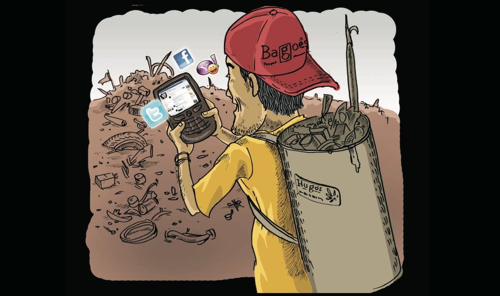
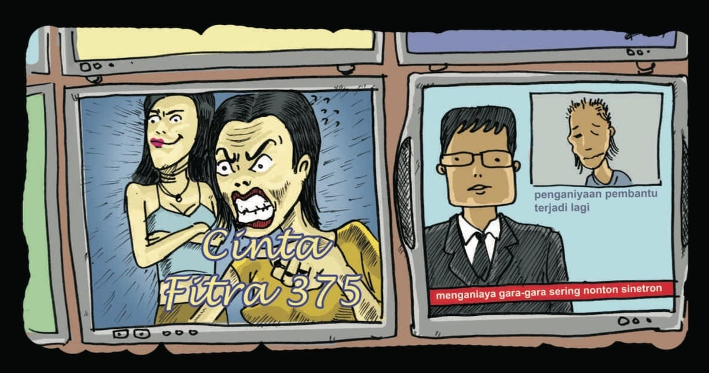

Rekan-rekan lihat berita di TV hari ini? Tapi saya tidak akan membahas wakil kita di Senayan itu. Saya lebih memilih menampilkan beberapa kutipan menarik dari majalah Bajigur edisi #7 yang baru saja saya baca kembali.

Bajigur ini majalah elektronik (e-zine) yang mengangkat tema-tema desain grafis yang ada sangkutpautnya dengan kehidupan sehari-hari. Edisi #7 ini merupakan edisi terbaru dari Bajigur yang mengangkat tema "Ironi". Sesuai dengan tema yang disuguhkannya, Bajigur kali ini berisi ulasan-ulasan dan ilustrasi-ilustrasi mengenai hal-hal yang bertentangan dengan fakta yang sebenarnya. Berikut adalah kutipannya:

### Ironi \#1

> Bercermin itu upaya kita melihat siapa kita, tapi faktanya banyak orang yang lebih suka melihat "orang lain" di cermin itu. Sibuklah ia memutihkan kulitnya, meluruskan rambutnya, melangsingkan tubuhnya. —Rahadian P. Paramita

### Ironi \#2

> Ironi adalah makan siang dengan sop buntut sembari nonton berita di tv tentang bencana di padang & kesedihan orang lainnya, sembari berucap, "kasihan..." tapi makan kita nambah. —Malhaf Budiharto

### Ironi \#3

> Ironi muncul di sekitar kita ketika kita mengerti begitu berharganya kehidupan kita di dunia ini. Ketika kita bisa makan enak, apakah di benak kita sering terpikirkan akan mereka yang tidak mengisi perutnya untuk hari ini. —Michael Johan

### Ironi \#4

> Ironi menurut saya adalah: ketika tiba-tiba bis yang saya tumpangi ngebut melewati halte dan ketika saya signal untuk berhenti dia menolak dengan alasan ada Polisi berdiri menjaga di dekat situ dan malah menurunkan saya di depan pertigaan. —Nataya Pqho

### Ironi \#5

Ironi sekarang banyak yang sudah bersekutu. Misalnya singkong dan keju. Dulu makanan ini ibarat si kaya dan si miskin. Singkong ibarat makanan yang mencitrakan bagaimana sebuah kemiskinan didefinisikan oleh kebiasaan orang-orang desa miskin yang "hobi" makan nasi tiwul. Maklum dulu nasi atau beras masih langka. Dan kan kamu tahu, keju itu diimpor dari Eropa.

Tentu saja Eropa berteman erat dengan yang namanya gemah ripah loh jinawi. Tidak bisa dipungkiri makanan berbahan dari susu itu jadi ikon untuk kejayaan negeri barat.

Tapi sekarang sudah ada singkong keju, digerai-gerai makanan, banyak juga peminatnya. Si kaya dan si miskin sekarang bersatu membentuk makanan yang cukup enak. Kalau semua menyadari ini, tentunya tak akan lagi ironi. bahwa perbedaan bisa saling mengisi. laiknya yin dan yang dalam kepercayaan masyarakat Cina.

—Uapm Inovasi

### Ironi \#6

### Ironi \#7

Sumber foto dan ilustrasi:
* Foto dari [Unsplash](https://unsplash.com/photos/fsLDdUqDPNo) oleh [LIM ENG](https://unsplash.com/@shadoweng93).
* Ilustrasi dari [Bajigur Kreatif](https://bajigurkreatif.blogspot.com/).
